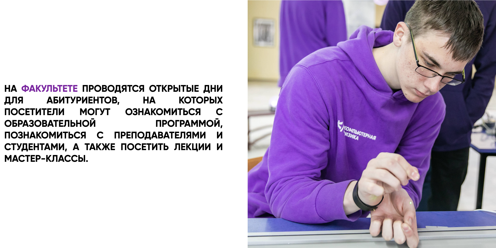

<h1 style="text-align: center;">Computer Physics </h1>

Welcome to the Computer Physics Career Guidance! 🚀 This repository is dedicated to providing valuable resources and information for students pursuing a career in computer physics. Whether you're just starting out or looking to advance your career, we've got you covered.

<h2>About</h2>

Computer physics is an exciting and dynamic field that combines principles of computer science and physics to solve complex problems and drive innovation. This page serves as a hub for career guidance, offering insights, tips, and resources tailored specifically for computer physics enthusiasts.

<h2>What You'll Find</h2>

<ul style="font-size: 20px">
    <li><strong>Student Activity:</strong> Stay updated on the latest student activities, events, workshops, and competitions related to computer physics. Get involved, network with peers, and enhance your skills outside the classroom.</li>
    <li><strong>Contact Information:</strong> Need assistance or have questions? Find contact information for the dean's office and relevant faculty members who can provide guidance and support throughout your academic journey.</li>
    <li><strong>Passing Scores from Previous Years:</strong> Gain insight into the performance of previous students with passing scores from previous years' exams. Use this information to benchmark your progress and tailor your study approach effectively.</li>
</ul>

